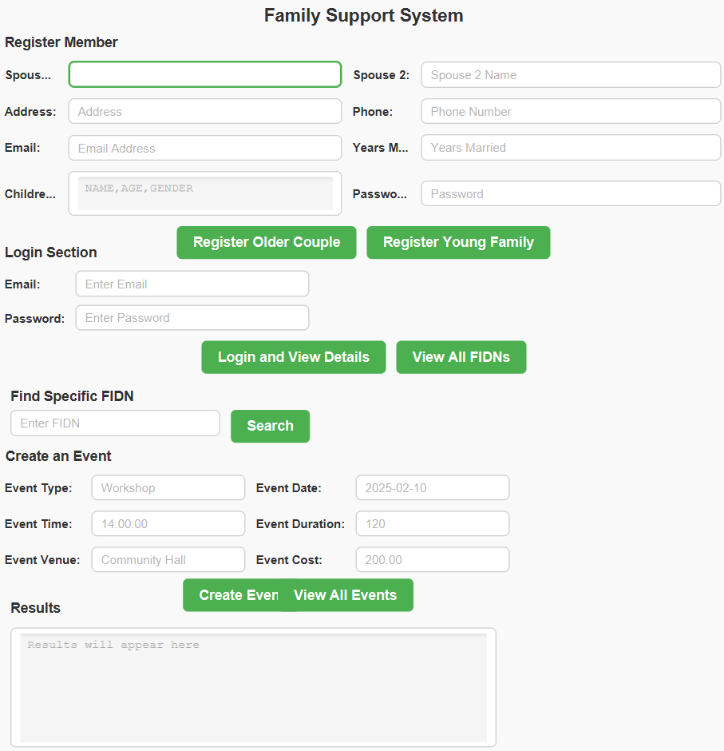

Here's a comprehensive `README.md` file template for your project. It includes details on the project, its dependencies, installation, and how to run it.

---

# **Family Support System**

## **Project Description**
This project is a **JavaFX-based Family Support System** that provides functionalities for registering families (older couples and young families), managing events, and enabling secure user authentication using encrypted communication between the client and server. The project uses **JavaFX**, **Maven**, and a **MySQL database**.

---

## **Features**
1. **Registration**:
   - Register Older Couples with details such as names, address, phone, email, years married, and password.
   - Register Young Families with similar details along with children's information.
2. **Login**:
   - Secure sign-in with encrypted passwords.
   - User authentication on the server side.
3. **Event Management**:
   - Create and view events with details like event type, date, time, venue, duration, and cost.
4. **Security**:
   - RSA encryption for password transmission between client and server.
   - Decryption on the server using a private key.
5. **Database Integration**:
   - Uses a MySQL database for storing and managing family and event data.

---

## **Technologies Used**
- **Programming Language**: Java
- **Framework**: JavaFX
- **Build Tool**: Maven
- **Database**: MySQL
- **Encryption**: RSA Encryption (Java Security API)

---

Based on your NetBeans project structure, here's the updated folder structure for the `README.md` file:

```markdown
## **Folder Structure**
```
Here’s the updated folder structure in a plain format for your `README.md` file:

---

## **Folder Structure**
```
Distributed_Assessment1/
├── src/
│   ├── main/
│   │   ├── java/
│   │   │   ├── module-info.java
│   │   │   └── com/
│   │   │       └── mycompany/
│   │   │           └── distributed_assessment1/
│   │   │               ├── App.java                  # Main JavaFX application
│   │   │               ├── Child.java               # Child class for Young Family
│   │   │               ├── Client.java              # Client implementation
│   │   │               ├── Controller.java          # Controller for main FXML
│   │   │               ├── DatabaseConnection.java  # Database utility
│   │   │               ├── FileHandler.java         # File handling utility (if used)
│   │   │               ├── OlderCouple.java         # Older Couple entity
│   │   │               ├── Person.java              # Abstract base class for Person
│   │   │               ├── PrimaryController.java   # Controller for primary.fxml
│   │   │               ├── SecondaryController.java # Controller for secondary.fxml
│   │   │               ├── Server.java              # Server implementation
│   │   │               └── YoungFamily.java         # Young Family entity
│   │   ├── resources/
│   │       └── com/
│   │           └── mycompany/
│   │               └── distributed_assessment1/
│   │                   ├── FXML.fxml                # Main FXML file
│   │                   ├── primary.fxml             # Primary layout FXML
│   │                   ├── secondary.fxml           # Secondary layout FXML
│   │                   ├── styles.css               # CSS for styling
├── pom.xml                                          # Maven configuration
├── nbactions.xml                                    # NetBeans configuration
└── README.md                                        # Project description
```

---

## **Requirements**
1. **Java Development Kit (JDK)**:
   - Version: 17 or higher (ensure compatibility with JavaFX).
2. **JavaFX**:
   - Version: 22.0.0
3. **MySQL**:
   - Version: 8.0 or higher.
4. **Maven**:
   - Version: 3.6 or higher.

---

## **Setup Instructions**

### **1. Clone the Repository**
```bash
git clone https://github.com/yourusername/Distributed_Assessment1.git
cd Distributed_Assessment1
```

### **2. Configure the Database**
1. **Create a MySQL Database**:
   - Name: `family_support_system`.
   - Run the following script to create tables:
     ```sql
     CREATE DATABASE family_support_system;

     USE family_support_system;

     CREATE TABLE older_couple (
         fidn VARCHAR(255) PRIMARY KEY,
         spouse1_name VARCHAR(255),
         spouse2_name VARCHAR(255),
         phone VARCHAR(20),
         email VARCHAR(255),
         address VARCHAR(255),
         years_married INT,
         password VARCHAR(255)
     );

     CREATE TABLE young_family (
         fidn VARCHAR(255) PRIMARY KEY,
         spouse1_name VARCHAR(255),
         spouse2_name VARCHAR(255),
         phone VARCHAR(20),
         email VARCHAR(255),
         address VARCHAR(255),
         password VARCHAR(255)
     );

     CREATE TABLE children (
         id INT AUTO_INCREMENT PRIMARY KEY,
         fidn VARCHAR(255),
         child_name VARCHAR(255),
         age INT,
         gender VARCHAR(10),
         FOREIGN KEY (fidn) REFERENCES young_family(fidn)
     );

     CREATE TABLE event (
         id INT AUTO_INCREMENT PRIMARY KEY,
         event_type VARCHAR(255),
         event_date DATE,
         event_time TIME,
         event_duration INT,
         event_venue VARCHAR(255),
         event_cost DECIMAL(10, 2)
     );
     ```

2. **Update `DatabaseConnection.java`**:
   - Replace the placeholders with your MySQL credentials:
     ```java
     private static final String URL = "jdbc:mysql://localhost:3306/family_support_system";
     private static final String USER = "your-username";
     private static final String PASSWORD = "your-password";
     ```

### **3. Install Dependencies**
Run the following Maven command to install all required dependencies:
```bash
mvn clean install
```

### **4. Run the Server**
Start the server:
```bash
cd target/classes
java com.mycompany.distributed_assessment1.Server
```

### **5. Run the Client**
Start the client:
```bash
java com.mycompany.distributed_assessment1.App
```

---

## **How to Use**
1. **Registration**:
   - Enter the required details in the registration form.
   - Click on `Register Older Couple` or `Register Young Family`.
2. **Login**:
   - Use the email and password to log in.
3. **Event Management**:
   - Create events and view existing ones.
4. **Results Section**:
   - Check the output or server responses in the designated area.

---

## **Screenshots**


---

## **Known Issues**
- Ensure that JavaFX is correctly set up in your environment.
- Verify the database connection before running the application.

---

## **Contributing**
Contributions are welcome! Feel free to submit a pull request.

---

## **License**
This project is licensed under the MIT License. See the LICENSE file for details.

---
